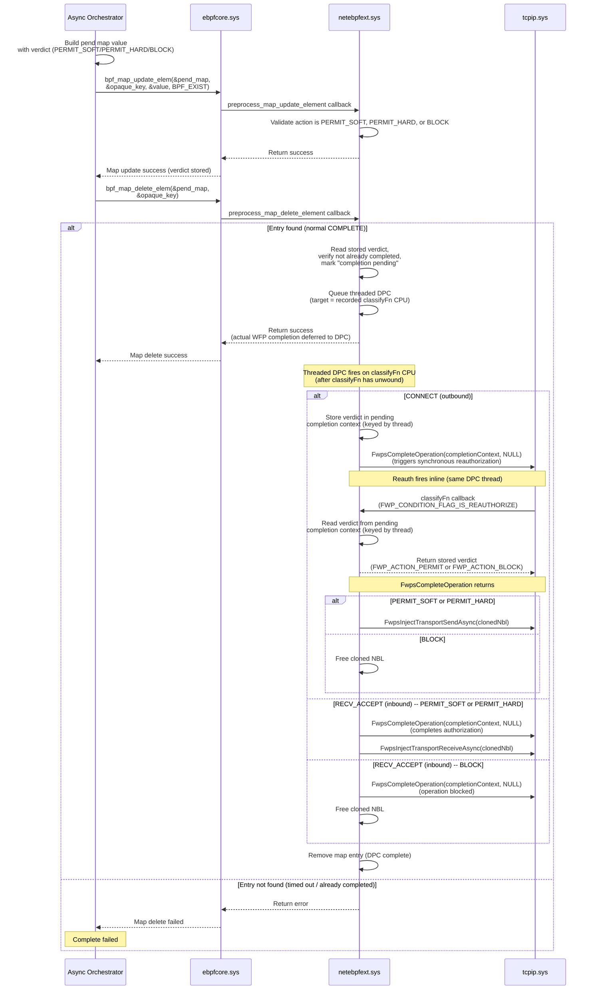
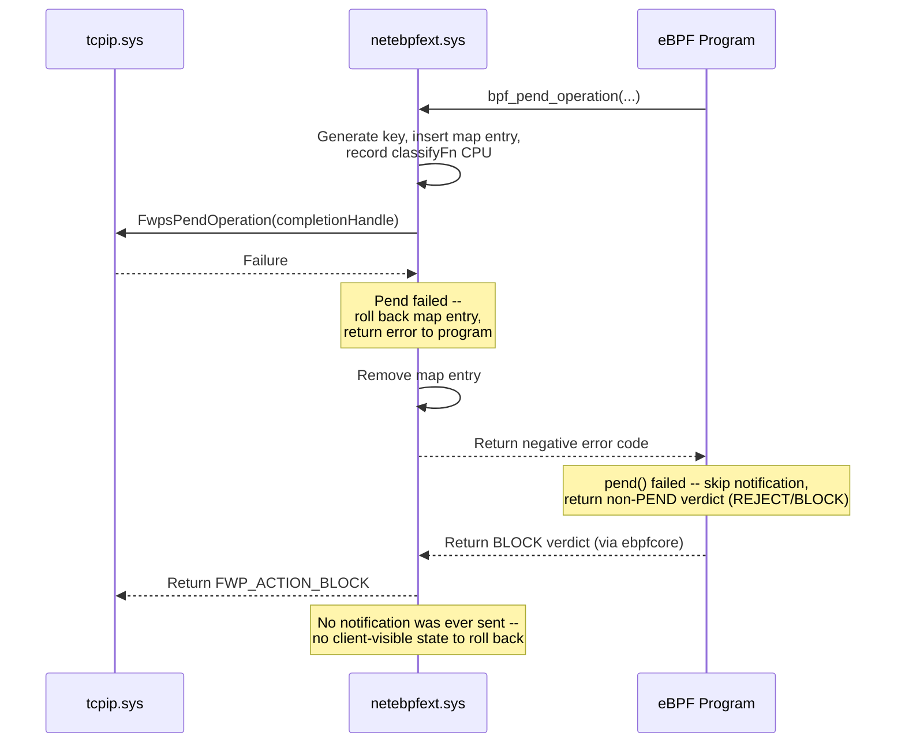

# Async Processing (Pend/Complete) for eBPF Network Extensions

## Contents
- [Motivation](#motivation)
- [Requirements](#requirements)
- [Design overview](#design-overview)
  - [Custom map for pend state](#custom-map-for-pend-state)
  - [Extension helper functions](#extension-helper-functions)
  - [Map key and value structures](#map-key-and-value-structures)
  - [Example eBPF program usage](#example-ebpf-program-usage)
- [PEND flow](#pend-flow)
- [COMPLETE flow](#complete-flow)
- [CONTINUE flow](#continue-flow)
- [Failure flows](#failure-flows)
- [Edge case and failure handling](#edge-case-and-failure-handling)
- [Internal pend state tracking](#internal-pend-state-tracking)
- [Multiple attached programs and PEND](#multiple-attached-programs-and-pend)
- [WFP implementation requirements](#wfp-implementation-requirements)
- [Per-layer async design](#per-layer-async-design)
  - [AUTH_CONNECT / AUTH_RECV_ACCEPT](#auth_connect--auth_recv_accept)
  - [AUTH_LISTEN](#auth_listen-layer)
  - [RESOURCE_ASSIGNMENT (Bind)](#resource_assignment-bind-layer)
  - [DATAGRAM_DATA](#datagram_data-layer)
  - [STREAM](#stream-layer)
- [Async orchestrator integration guide](#async-orchestrator-integration-guide)
- [ebpfcore platform requirements](#ebpfcore-platform-requirements)
- [netebpfext work breakdown](#netebpfext-work-breakdown)
- [Appendix: Internal state struct](#appendix-internal-state-struct)

## Motivation

Network callout drivers often need to defer a verdict on a connection or
packet while waiting for an asynchronous decision from another component
-- for example, a user-mode policy service or a kernel-mode classification
driver. The Windows Filtering Platform (WFP) provides several async
mechanisms at different layers (`FwpsPendOperation` /
`FwpsCompleteOperation` at ALE authorize layers, `FwpsPendClassify` /
`FwpsCompleteClassify` at resource assignment, ABSORB+reinject at
datagram, DEFER/OOB at stream), but eBPF programs running through
netebpfext currently have no way to express "pend this operation and
complete it later."

This proposal adds **pend/complete (async processing) support** to
netebpfext, enabling eBPF programs to:
1. **PEND** a network operation -- absorb a connection/packet while an
   external component makes a decision asynchronously.
2. **COMPLETE** the pended operation with a verdict (PERMIT, BLOCK, or
   CONTINUE -- re-invoke the program for continued evaluation; the
   program starts a fresh invocation, not a mid-execution resume).

The design is generic: any async orchestrator (kernel-mode driver, user-mode
service, or both) can integrate with pend/complete by interacting with
eBPF maps and optional BTF-resolved functions. No changes to the
async orchestrator's notification or decision-delivery mechanism are prescribed by
netebpfext itself.

## Requirements

### Functional requirements
1. An eBPF program attached to a supported WFP hook point (see
   [Supported WFP layers](#supported-wfp-layers)) must be able to
   pend the current network operation and return control to WFP.
2. An external async orchestrator must be able to complete the pended operation
   with a verdict (PERMIT, BLOCK, or CONTINUE) at a later time.
   Bounding "later" is the orchestrator's responsibility -- the
   extension provides backstops (per-entry stale-entry watchdog and a
   bounded `max_entries` map) but does not guarantee an upper bound on
   completion latency. See [Edge case 1: Stale pended operations](#1-stale-pended-operations-complete-never-arrives).
3. The CONTINUE verdict must re-invoke the eBPF program so it can
   resume evaluation from where it left off.
   Re-invocation is asynchronous on a worker thread at PASSIVE_LEVEL
   (not synchronous inside the COMPLETE call) and is not pinned to
   the original `classifyFn` CPU. See [CONTINUE flow](#continue-flow)
   for the full sequence.
4. The pend/complete mechanism must be fully encapsulated within
   netebpfext -- eBPF programs and async orchestrators interact only through
   maps and helper functions; no WFP-specific details leak to callers.

### Supported WFP layers

The design must support pend/complete at the following WFP layers:

| Layer | WFP layer IDs | Async mechanism |
|-------|---------------|-----------------|
| Connect (outbound) | `FWPM_LAYER_ALE_AUTH_CONNECT_V4/V6` | `FwpsPendOperation` / `FwpsCompleteOperation` |
| Accept (inbound) | `FWPM_LAYER_ALE_AUTH_RECV_ACCEPT_V4/V6` | `FwpsPendOperation` / `FwpsCompleteOperation` |
| Listen | `FWPM_LAYER_ALE_AUTH_LISTEN_V4/V6` | `FwpsPendOperation` / `FwpsCompleteOperation` |
| Bind | `FWPM_LAYER_ALE_RESOURCE_ASSIGNMENT_V4/V6` | `FwpsPendClassify` / `FwpsCompleteClassify` |
| Datagram | `FWPM_LAYER_DATAGRAM_DATA_V4/V6` | ABSORB + reinject (no pend API) |
| Stream | `FWPM_LAYER_STREAM_V4/V6` | DEFER (inbound) / OOB clone+reinject (outbound) |

Each layer requires different WFP async APIs and completion semantics.
See [Per-layer async design](#per-layer-async-design) for details.

> **Note:** Not all layers listed above are currently supported in
> netebpfext. When support is added for new WFP layers, the
> implementation should account for the pend/async design described
> in this proposal.

### Non-requirements
- The notification mechanism between the eBPF program and the async orchestrator
  is **not** part of this proposal. Async orchestrators are responsible for
  choosing how to deliver pend notifications and receive verdicts (see
  [Async orchestrator integration guide](#async-orchestrator-integration-guide)).
- Only one program in a multi-program chain may PEND a given operation
  (see [Multiple attached programs and PEND](#multiple-attached-programs-and-pend)).

## Design overview

Using pend/complete requires an external component -- referred to in
this document as the **async orchestrator** -- that coordinates the
pend lifecycle: loading the eBPF program, owning the pend map,
receiving pend notifications, making asynchronous decisions, driving
the COMPLETE path via map operations, and cleaning up stale entries.
The async orchestrator may be a single kernel-mode driver, a single
user-mode process, or a combination of both -- the architecture is
up to the integrator. See
[Async orchestrator integration guide](#async-orchestrator-integration-guide)
for details.

### Custom map for pend state
The design leverages the
[custom map](https://github.com/microsoft/ebpf-for-windows/pull/4882)
feature. Custom maps allow an eBPF extension to register as an NMR
provider for a custom map type and intercept CRUD operations on map
entries.

Two distinct paths invoke the extension's callbacks:

1. **User-mode CRUD via `bpf_map_*` syscalls.** When the async
   orchestrator calls `bpf_map_update_elem` or `bpf_map_delete_elem`
   on a pend map entry, ebpfcore dispatches synchronously through
   the custom map provider's dispatch table to the extension's
   `preprocess_map_update_element` / `preprocess_map_delete_element`
   callbacks. (Lookups go through `postprocess_map_find_element`.)
   `bpf_map_update_elem` covers both insert and replace semantics.
   These callbacks run **synchronously** and **serialized per map**
   (ebpfcore acquires a per-map lock before invoking the callback).
   This path uses **existing** custom map provider machinery.
2. **Extension-initiated kernel-mode CRUD from the `pend()` helper
   and from the threaded DPC.** Insertion of a new pend entry, the
   COMPLETE-side lookup, and the post-completion delete are all
   driven by netebpfext directly (kernel mode, outside an eBPF helper
   call) -- not by the eBPF program calling `bpf_map_update_elem`.
   The program's only path into the map is via the `pend()` extension
   helper. This path requires **new ebpfcore APIs** (kernel-mode
   entry points exposed to providers) that do not exist today; see
   [ebpfcore platform requirements](#ebpfcore-platform-requirements).

This provides a data communication mechanism between netebpfext (which
implements pend/complete semantics via the layer-specific WFP async APIs)
and the async orchestrator (which reacts to the pend
and issues a verdict once finished).

> **Note:** This design requires several ebpfcore changes: a new
> custom map type enum, full CRUD support for custom map operations
> (from both user mode and kernel mode), and namespace isolation.
> See [ebpfcore platform requirements](#ebpfcore-platform-requirements)
> for details.

### Extension helper functions

The extension exposes one helper function:

- **`bpf_pend_operation()`** -- called by the eBPF program to
  pend the current classify. It generates an opaque key, populates
  the map entry, **records the current CPU number (`classifyfn_cpu`)
  for later DPC dispatch, and synchronously invokes the
  layer-appropriate WFP pend API** (e.g., `FwpsPendOperation`,
  `FwpsPendClassify`). On success it captures the WFP classify
  parameters needed for completion (e.g., `completionContext`,
  cloned NBL, reinject parameters) and returns the opaque key to
  the caller. On failure (WFP pend API fails) it rolls back the map
  entry and returns a negative error code; the program then returns
  a non-PEND verdict. Works on all supported layers.

The helper does not take an explicit `ctx` parameter. Instead, ebpfcore
exposes an **implicit program context** accessor
(`ebpf_get_current_program_context()`), avoiding consumption of a BPF
argument slot. All pointer arguments use `void*` + `uint32_t` size
pairs for verifier compatibility (`PTR_TO_MEM` + `CONST_SIZE`).

The program calls `pend()` to insert a map entry, pend the WFP
operation, and receive an opaque key. **Only after `pend()` returns
success** does the program notify the async orchestrator (e.g., via
a BTF-resolved function or a shared map), passing the opaque key so
the async orchestrator can issue a COMPLETE later.

This ordering -- WFP pend before notification -- structurally closes
the "COMPLETE-arrives-before-pend" race; see
[Race A](#race-a-complete-arrives-before-the-wfp-pend-api-is-called)
for the full argument.

If notification fails (or the program returns a non-PEND verdict for
any other reason after a successful `pend()`), netebpfext synthesizes
the COMPLETE path from the same threaded-DPC machinery used by the
orchestrator-driven COMPLETE; see
[Notification fails](#notification-fails) and
[PEND flow](#pend-flow) for the mechanism.

### Map key and value structures

#### Map key
The map key is **opaque to callers**. The extension generates and
manages the key internally. Programs and async orchestrators pass the key through
without interpreting its contents. Both the key and value structures
include an `ebpf_extension_header_t` as their first field, following
the standard eBPF for Windows versioning convention (see
`ebpf_windows.h`). This allows new fields to be appended in future
versions without breaking backward compatibility.

```c
// Opaque key structure -- callers must not interpret or construct these fields.
// The extension populates this via bpf_pend_operation() and returns it to the caller.
// Versioned using the standard ebpf_extension_header_t pattern (see ebpf_windows.h).
typedef struct _net_ebpf_ext_pend_key {
    ebpf_extension_header_t header;     // Version/size header for forward compatibility
    uint64_t pend_id;                   // Monotonic counter generated by the extension
} net_ebpf_ext_pend_key_t;
```

#### Map value
The map value has a **minimum prefix** defined by the extension: a
single `action` field that the extension reads to distinguish a new
PEND insertion from a COMPLETE update (PERMIT_SOFT/PERMIT_HARD/BLOCK). Callers may
declare a larger value type with additional fields after this prefix --
the extension only accesses the prefix. The extension also appends its
own internal tracking fields (WFP layer ID, lifecycle state) after
the caller's value using the extension-controlled value size feature --
these are not visible to callers on lookups.

```c
typedef enum _net_ebpf_ext_pend_action {
    NET_EBPF_EXT_PEND_ACTION_PENDING       = 0,  // Operation is pended, awaiting orchestrator decision
    NET_EBPF_EXT_PEND_ACTION_PERMIT_SOFT   = 1,  // Orchestrator verdict: soft permit (other filters can still BLOCK)
    NET_EBPF_EXT_PEND_ACTION_PERMIT_HARD   = 2,  // Orchestrator verdict: hard permit (overrides remaining filters at this layer)
    NET_EBPF_EXT_PEND_ACTION_BLOCK         = 3,  // Orchestrator verdict: block (maps to hard block in WFP, matching BPF_SOCK_ADDR_VERDICT_REJECT)
    NET_EBPF_EXT_PEND_ACTION_CONTINUE      = 4,  // Orchestrator verdict: re-invoke program to continue evaluation
} net_ebpf_ext_pend_action_t;

// Minimum value prefix required by the extension.
// Programs may embed this in a larger value struct to store additional metadata.
// Versioned using the standard ebpf_extension_header_t pattern (see ebpf_windows.h).
typedef struct _net_ebpf_ext_pend_value {
    ebpf_extension_header_t header;     // Version/size header for forward compatibility
    net_ebpf_ext_pend_action_t action;  // Set to PENDING by pend; read by extension on COMPLETE/CONTINUE
} net_ebpf_ext_pend_value_t;
```

> **Verdict mapping.** `PERMIT_SOFT` and `PERMIT_HARD` map to the
> same WFP outcomes as `BPF_SOCK_ADDR_VERDICT_PROCEED_SOFT` and
> `BPF_SOCK_ADDR_VERDICT_PROCEED_HARD` would when returned
> synchronously by a sock_addr program. `BLOCK` maps to a hard
> block (matching `BPF_SOCK_ADDR_VERDICT_REJECT`); the eBPF API
> does not expose a soft-block variant. Other layers that do not
> distinguish soft/hard permit (e.g., RESOURCE_ASSIGNMENT) treat
> both `PERMIT_SOFT` and `PERMIT_HARD` as a plain permit.

#### Map type
```c
// Custom map type for pend/complete operations (value TBD, must be added to ebpf_structs.h)
#define BPF_MAP_TYPE_NET_EBPF_EXT_PEND <TBD>  // To be defined in ebpf_map_type_t enum
```

#### Extension helper function prototypes
```c
// Pends the current classify. Generates a unique key, sets
// action=PENDING, appends internal tracking state, records the
// current CPU number for later threaded-DPC dispatch, inserts
// the entry, and synchronously invokes the layer-appropriate WFP
// pend API (FwpsPendOperation / FwpsPendClassify). On success the
// caller-visible map entry is populated and the opaque key is
// returned via the key out-parameter. On failure the map entry is
// rolled back and a negative error code is returned; the caller
// should return a non-PEND verdict.
// Returns: 0 on success, negative error code on failure.
int bpf_pend_operation(_In_ void* pend_map,
                               _In_reads_bytes_(value_size) void* value,
                               uint32_t value_size,
                               _Inout_updates_bytes_(key_size) void* key,
                               uint32_t key_size);
```

### Example eBPF program usage
```c
// Orchestrator-defined extended pend map value -- embeds the extension-required
// prefix and adds orchestrator-specific fields.
typedef struct _my_pend_map_value {
    net_ebpf_ext_pend_value_t base;     // Extension-required prefix (action)
    uint64_t orchestrator_context;      // Orchestrator-defined context
    uint64_t timestamp;                 // Set by program at pend time; used for stale-entry expiration
} my_pend_map_value_t;

struct {
    __uint(type, BPF_MAP_TYPE_NET_EBPF_EXT_PEND);
    __type(key, net_ebpf_ext_pend_key_t);
    __type(value, my_pend_map_value_t);
    __uint(max_entries, 1024);  // Illustrative. This is a hard cap on concurrent pends:
                                // ebpfcore backs the custom map with a hash table whose bucket
                                // array is pre-sized to max_entries, so the value also drives
                                // resident memory cost. Pick a value that covers worst-case
                                // concurrent pends for the orchestrator's workload (and
                                // consider exposing it as a tunable).
} pend_map SEC(".maps");

// ... in program logic:
net_ebpf_ext_pend_key_t opaque_key = {};
my_pend_map_value_t value = {};

value.orchestrator_context = /* orchestrator-defined identifier */;
value.timestamp = bpf_ktime_get_boot_ns();

int err = bpf_pend_operation(&pend_map, &value, sizeof(value), &opaque_key, sizeof(opaque_key));
if (err != 0) {
    // pend() failed (e.g., FwpsPendOperation returned an error).
    // The map entry has been rolled back; return a non-PEND verdict.
    return DEFAULT_VERDICT;
}

// pend() succeeded -- the WFP operation is now pended and the
// opaque key is valid. Notify the async orchestrator about the
// pended operation. This is orchestrator-specific -- could be a
// BTF-resolved function call, a write to a shared map (perf event
// array, ring buffer), or any other mechanism. The orchestrator
// needs the opaque_key to issue the COMPLETE later.
int notify_result = notify_orchestrator(&opaque_key, /* ... */);
if (notify_result != 0) {
    // Notification failed -- return non-PEND verdict.
    // netebpfext detects this and synthesizes the COMPLETE path
    // (queues a threaded DPC on the recorded classifyfn_cpu to
    // call FwpsCompleteOperation after classifyFn unwinds).
    return BPF_SOCK_ADDR_VERDICT_REJECT;
}

return BPF_SOCK_ADDR_VERDICT_PEND;  // New verdict added by this proposal -- see ebpf_nethooks.h work item.
```

## PEND flow
1. The eBPF extension registers as a custom map provider (NMR provider
   for the Map Information NPI), defining the pend map type.
2. The eBPF program declares a map of this custom type to hold pended
   operations.
3. When the eBPF program determines that the current operation needs
   to be pended:
    1. The program populates the caller-visible value, then calls
       `bpf_pend_operation(&pend_map, &value, sizeof(value), &opaque_key, sizeof(opaque_key))`
       -- an extension helper function exposed by netebpfext. The
       extension generates a unique key (monotonic counter), sets
       `action = PENDING` in the value prefix, appends internal
       tracking state (WFP layer ID, recorded classifyFn CPU number),
       inserts the entry into the map, and **synchronously invokes
       the layer-specific WFP pend API** (e.g., `FwpsPendOperation()`
       for ALE authorize layers, `FwpsPendClassify()` for Bind --
       see [Per-layer async design](#per-layer-async-design)).
        - **If the WFP pend API succeeds:** the helper stores the
          pend context, performs any layer-specific work
          (clone NBL, acquire classify handle, save reinject params),
          and returns `0` plus the opaque key.
        - **If the WFP pend API fails:** the helper rolls back the
          map entry and returns a negative error code. The program
          must return a non-PEND verdict; no notification was sent,
          so there is no client-visible state to clean up.
    2. After `pend()` returns success, the program notifies the
       async orchestrator about the pended operation (using an
       orchestrator-specific mechanism -- see
       [Async orchestrator integration guide](#async-orchestrator-integration-guide)),
       passing the opaque key so the async orchestrator can issue a
       COMPLETE later.
        - This notification must be synchronous so the eBPF program
          can handle failure inline (by returning a non-PEND verdict).
        - **If notification fails:** The eBPF program returns a
          non-PEND verdict (e.g., BLOCK). netebpfext detects that the
          program returned a non-PEND verdict after a successful
          `pend()`, stores the verdict, and synthesizes the COMPLETE
          path -- it queues a threaded DPC on the recorded
          `classifyfn_cpu` to invoke the WFP completion API after
          `classifyFn` has unwound. No explicit cleanup by the
          program is needed.
    3. The eBPF program returns the `BPF_SOCK_ADDR_VERDICT_PEND`
       verdict. netebpfext sees this verdict and the entry remains
       in the pend map awaiting the orchestrator's COMPLETE. The
       extension returns the appropriate WFP action to absorb the
       operation (e.g., `FWP_ACTION_BLOCK | FWPS_CLASSIFY_OUT_FLAG_ABSORB`).

> **Race protection: COMPLETE before pend API.**
> Because `FwpsPendOperation()` runs synchronously inside the
> `pend()` helper -- *before* the helper returns the opaque key to
> the program -- the orchestrator can only learn the key after WFP
> has accepted the pend. The "COMPLETE arrives before pend API was
> called" race is therefore structurally impossible.

```mermaid
sequenceDiagram
    participant tcpip as tcpip.sys
    participant ebpfext as netebpfext.sys
    participant ebpfcore as ebpfcore.sys
    participant bpfprog as eBPF Program
    participant orchestrator as Async Orchestrator

    tcpip->>ebpfext: Network event (WFP callout)
    ebpfext->>ebpfcore: Invoke eBPF program
    ebpfcore->>bpfprog: Execute program
    bpfprog->>bpfprog: Process rules, determine pend needed

    bpfprog->>ebpfext: bpf_pend_operation(&pend_map,<br/>&value, sizeof(value),<br/>&opaque_key, sizeof(opaque_key))<br/>(extension helper)
    ebpfext->>ebpfext: Generate key, insert map entry,<br/>record classifyFn CPU
    ebpfext->>tcpip: FwpsPendOperation(completionHandle)<br/>(layer-specific pend API)
    tcpip-->>ebpfext: Success + completionContext
    ebpfext->>ebpfext: Store pend context, clone NBL,<br/>save reinject params
    ebpfext-->>bpfprog: Return 0 + opaque key

    bpfprog->>orchestrator: Notify async orchestrator<br/>(orchestrator-specific mechanism,<br/>passes opaque_key)
    orchestrator-->>bpfprog: Return success

    bpfprog-->>ebpfcore: Return PEND verdict
    ebpfcore-->>ebpfext: Return PEND verdict
    ebpfext-->>tcpip: Return FWP_ACTION_BLOCK + ABSORB<br/>(operation pended; entry awaits<br/>orchestrator COMPLETE)
```

## COMPLETE flow

> **Important:** The layer-specific completion API (e.g.,
> `FwpsCompleteOperation()`) is **only** invoked from a **threaded
> DPC** queued onto the recorded `classifyfn_cpu`. The DPC is
> queued from the `preprocess_map_delete_element` callback when the
> orchestrator calls `bpf_map_delete_elem`; netebpfext does not
> initiate completion on its own. From the orchestrator's
> perspective, `bpf_map_delete_elem` returns success once the DPC is
> queued -- the actual WFP completion is asynchronous to that
> return. All error and edge-case handling must be driven by the
> async orchestrator (see
> [Edge case and failure handling](#edge-case-and-failure-handling)).
> For CONTINUE, the orchestrator calls `bpf_map_update_elem` only --
> no delete -- see [CONTINUE flow](#continue-flow).
>
> For each pend entry, exactly one completion owner is active at a
> time: the orchestrator owns direct verdict handling; the extension
> owns terminal completion after CONTINUE re-invocation.

> **Why a threaded DPC on `classifyfn_cpu`?** See
> [Race B](#race-b-in-classifyfn-fwpscompleteoperation-drops-auth-context-refcount-2---1)
> for the full refcount analysis.

1. The async orchestrator makes its decision (asynchronously) and
   prepares to deliver the verdict.
2. For **PERMIT_SOFT, PERMIT_HARD, or BLOCK**, the async orchestrator uses the opaque
   pend key and performs two map operations:
   1. **Update verdict**: Call `bpf_map_update_elem` with `BPF_EXIST`
      to write the verdict (permit/block/continue) into the entry's
      `action` field. The extension's `preprocess_map_update_element`
      callback validates that the action is `PERMIT_SOFT`, `PERMIT_HARD`, `BLOCK`, or
      `CONTINUE` (not `PENDING`). For PERMIT_SOFT/PERMIT_HARD/BLOCK, this stores the
      verdict for the subsequent delete. For CONTINUE, the extension
      queues a work item to re-invoke the program (see
      [CONTINUE flow](#continue-flow)). If the entry does not exist
      (e.g., the stale-entry timeout removed it),
      `bpf_map_update_elem` returns an error.
   2. **Delete entry**: Call `bpf_map_delete_elem` with the same key.
      The extension's `preprocess_map_delete_element` callback reads the
      stored verdict from the `action` field, marks the entry
      "completion pending", and **queues a threaded DPC targeted at
      the recorded `classifyfn_cpu`**. The DPC fires after that CPU
      has unwound the original `classifyFn` and runs the
      layer-dependent completion (see
      [Per-layer async design](#per-layer-async-design)). The map
      entry is removed when the DPC completes.
3. The async orchestrator checks the return values. On success
   (DPC queued), the operation is logically complete from the
   orchestrator's perspective. On failure (entry not found on update,
   or delete fails), it logs the failure. Direct orchestrator verdict
   completion is orchestrator-owned; netebpfext returns map API
   errors and runs the deferred completion in the threaded DPC. For
   CONTINUE re-invocation that returns a final PERMIT/BLOCK,
   terminal completion is extension-owned and uses the same
   threaded-DPC dispatch.

> **CPU hot-unplug fallback.** If the recorded `classifyfn_cpu` is
> offline at DPC-queue time, netebpfext falls back to a generic
> worker thread; see
> [Race B](#race-b-in-classifyfn-fwpscompleteoperation-drops-auth-context-refcount-2---1)
> for why the race protection still holds.

The following diagram illustrates the COMPLETE flow for the
AUTH_CONNECT and AUTH_RECV_ACCEPT layers. Other layers use different
completion APIs -- see [Per-layer async design](#per-layer-async-design).



## CONTINUE flow

When the async orchestrator responds with CONTINUE (instead of PERMIT or BLOCK),
the pended operation is not yet decided. Instead, the eBPF program is
re-invoked to resume evaluation from where it left off. The program may
then return a final verdict (PERMIT/BLOCK) or PEND again for another
round of async processing.

CONTINUE differs from COMPLETE in two key ways:
1. **No map delete**: The async orchestrator calls
   `bpf_map_update_elem` with `action = CONTINUE` but does **not**
   call `bpf_map_delete_elem`. The pend map entry stays alive --
   the completion API is not called, and the WFP operation
   remains pended.
2. **Program re-invocation**: The extension queues a worker thread that
   re-invokes the eBPF program using a saved program context, allowing
   the program to continue its evaluation.

### Saved state for continuation

Two categories of state must be preserved to support CONTINUE:

**a) eBPF program context (saved by the extension):**
At pend time, the extension must save a copy of the eBPF program
context (e.g., `bpf_sock_addr_t`) in the internal tracking state.
The program context is constructed from the WFP classify parameters
(fixed values, metadata, layer data), which are stack-based and only
valid during the original `classifyFn` call -- once the pend API
is called and the callback returns, they are gone. The saved program
context allows the extension to re-invoke the program for CONTINUE
without needing the original WFP parameters.

**b) Program evaluation state (saved by the eBPF program):**
The eBPF program needs to store its evaluation resume point -- e.g.,
which rule was being evaluated, which filter node in the tree, any
intermediate results, and the opaque pend key (for re-PEND
notifications). This state is stored by the program in a **separate
regular hash map** (not the pend map) keyed by an identifier the
program can derive from the classify context (e.g., the connection
5-tuple from `bpf_sock_addr_t`).

The separate map is necessary because the pend map key is opaque -- the
program cannot derive it from context on re-invocation. A regular hash
map keyed by a context-derived identifier gives the program a stable
lookup key available in both the original and continuation invocations.
The program checks this map on **every invocation** -- if an entry
exists, it is a continuation; otherwise it is a fresh invocation.

```c
// Example: program-managed continuation state map
typedef struct _my_continuation_state {
    net_ebpf_ext_pend_key_t pend_key;   // Opaque key for re-PEND or COMPLETE
    // ... additional evaluation state as needed
} my_continuation_state_t;

struct {
    __uint(type, BPF_MAP_TYPE_HASH);
    __type(key, bpf_sock_addr_t);       // Connection tuple (or a hash/subset of it)
    __type(value, my_continuation_state_t);
    __uint(max_entries, 1024);
} continuation_map SEC(".maps");
```

### CONTINUE flow steps

1. The async orchestrator responds with CONTINUE and calls
   `bpf_map_update_elem` with `action = CONTINUE` on the pend map
   entry. The extension's `preprocess_map_update_element` callback validates
   the action and records the CONTINUE request.
2. The extension detects the CONTINUE action and queues a work item
   (the callback runs under the per-map lock -- re-invocation cannot
   happen inline because the eBPF program may perform map operations
   such as completion map updates/deletes (`bpf_map_update_elem` +
   `bpf_map_delete_elem`), and those would deadlock trying to
   re-acquire the same per-map lock). The pend map entry remains --
   no delete, no completion. The action is reset to `PENDING`.
3. The work item fires on a worker thread. The extension re-invokes
   the eBPF program through ebpfcore using the saved program context.
   netebpfext's classify wrapper runs in this context -- the same
   wrapper that handles the normal classify path. Because there is
   no live WFP `classifyFn` context on this thread, the program must
   not call `pend()` again (the operation is already pended, and
   `FwpsPendOperation` cannot be called during reauthorization). The
   re-invocation context is what tells netebpfext to skip the WFP
   pend API on a re-PEND.
4. The eBPF program checks the continuation map (keyed by a
   context-derived identifier). An entry exists, so the program
   resumes evaluation from the saved position.
5. The program evaluates and returns one of:
   - **PERMIT or BLOCK**: The program cleans up its continuation
     map entry and returns the verdict. netebpfext's classify wrapper
     reads the return value and performs `bpf_map_update_elem` (store
     verdict) then `bpf_map_delete_elem` -- the same completion path
     as the normal COMPLETE flow (queues a threaded DPC on the
     recorded `classifyfn_cpu`). The pend map entry is removed when
     the DPC completes.
   - **PEND**: The program hit another point requiring async
     processing. The program updates its continuation state in the
     continuation map (including the stored opaque key), sends a new
     notification to the async orchestrator using the stored key, and
     returns PEND. The entry remains in the pend map. netebpfext
     detects the re-invocation context and does **not** call the WFP
     pend API again.

> **Note:** On CONTINUE re-invocation, the program must **not** call
> `bpf_pend_operation()` again -- the existing pend map
> entry is still valid. netebpfext also must not call the WFP pend
> API again, since the WFP operation is already pended
> (`FwpsPendOperation` cannot be called during reauthorization, and
> the operation is still pended from the original call). The
> re-invocation context (no live `classifyFn`) is what tells
> netebpfext to skip the WFP pend API.

```mermaid
sequenceDiagram
    participant orchestrator as Async Orchestrator
    participant ebpfcore as ebpfcore.sys
    participant ebpfext as netebpfext.sys
    participant bpfprog as eBPF Program
    participant tcpip as tcpip.sys

    Note over orchestrator: Orchestrator decides: CONTINUE<br/>(resume program evaluation)

    orchestrator->>ebpfcore: bpf_map_update_elem(&pend_map,<br/>&opaque_key, &value{action=CONTINUE}, BPF_EXIST)
    ebpfcore->>ebpfext: preprocess_map_update_element callback
    ebpfext->>ebpfext: Validate CONTINUE action,<br/>reset action to PENDING,<br/>queue work item
    ebpfext-->>ebpfcore: Return success
    ebpfcore-->>orchestrator: Map update success

    Note over ebpfext: Work item fires on worker thread

    ebpfext->>ebpfcore: Invoke eBPF program<br/>(using saved program context)
    ebpfcore->>bpfprog: Execute program

    bpfprog->>bpfprog: Check continuation map<br/>(keyed by connection tuple)<br/>Entry found -- resume evaluation

    bpfprog->>bpfprog: Continue evaluation<br/>from saved position

    alt Program reaches final verdict (PERMIT/BLOCK)
        bpfprog->>bpfprog: Clean up continuation map entry
        bpfprog-->>ebpfcore: Return PERMIT or BLOCK verdict
        ebpfcore-->>ebpfext: Return verdict
        ebpfext->>ebpfext: Classify wrapper reads verdict,<br/>performs map update + delete<br/>(same completion path as COMPLETE flow)
        Note over ebpfext: Same completion path as<br/>normal COMPLETE flow
        ebpfext->>ebpfext: preprocess_map_delete_element:<br/>queue threaded DPC on recorded<br/>classifyFn CPU
        Note over ebpfext: DPC fires, runs layer-specific completion<br/>+ reinject/free; entry removed

    else Program needs to pend again (re-PEND)
        bpfprog->>bpfprog: Update continuation map<br/>(new resume point + stored pend key)
        bpfprog->>orchestrator: Notify async orchestrator<br/>(using stored pend key)
        orchestrator-->>bpfprog: Return success
        bpfprog-->>ebpfcore: Return PEND verdict
        ebpfcore-->>ebpfext: Return PEND verdict
        ebpfext->>ebpfext: Re-invocation context<br/>-- skip WFP pend API<br/>(cannot re-pend during reauth)
        Note over ebpfext: Entry remains in pend map,<br/>awaiting next orchestrator response
    end
```

## Failure flows

### Notification fails

`pend()` (and therefore the WFP pend API) has already succeeded when
the program calls the notification function. If notification returns
failure, the program returns a non-PEND verdict from inside
`classifyFn`. netebpfext synthesizes the standard COMPLETE path:
stores the verdict, marks the entry "completion pending", and queues
a threaded DPC on the recorded `classifyfn_cpu` to invoke the WFP
completion API after `classifyFn` unwinds.

> netebpfext locates the entry without needing additional WFP
> context: when `bpf_pend_operation()` was invoked from inside the
> classifyFn, the classify wrapper recorded the opaque key (and the
> classifyFn-local state needed to complete -- recorded CPU,
> completion context, layer parameters) in its on-stack
> per-classify state. After the program returns, the wrapper
> inspects that recorded state -- if a `pend()` was issued and the
> verdict is non-PEND, it already has the key in hand to drive the
> synthesized COMPLETE.

```mermaid
sequenceDiagram
    participant tcpip as tcpip.sys
    participant ebpfext as netebpfext.sys
    participant ebpfcore as ebpfcore.sys
    participant bpfprog as eBPF Program
    participant orchestrator as Async Orchestrator

    Note over bpfprog: pend() succeeded; WFP pend API succeeded<br/>(opaque key in hand)

    bpfprog->>orchestrator: Notify async orchestrator<br/>(orchestrator-specific mechanism)
    orchestrator-->>bpfprog: Return error

    Note over bpfprog: Notification failed -- abort the pend<br/>by returning a non-PEND verdict
    bpfprog-->>ebpfcore: Return REJECT verdict
    ebpfcore-->>ebpfext: Return verdict

    Note over ebpfext: Synthesized COMPLETE path<br/>(non-PEND verdict after successful pend())
    ebpfext->>ebpfext: bpf_map_update_elem (store verdict),<br/>bpf_map_delete_elem (mark "completion pending"),<br/>queue threaded DPC on recorded classifyFn CPU
    ebpfext-->>tcpip: Return FWP_ACTION_BLOCK + ABSORB

    Note over ebpfext: Threaded DPC fires on classifyFn CPU,<br/>post-classifyFn-unwind
    ebpfext->>tcpip: FwpsCompleteOperation(completionContext, NULL)<br/>(operationComplete fires inline<br/>on DPC thread)
    ebpfext->>ebpfext: Remove map entry
    Note over ebpfext: Pend cleanly terminated;<br/>orchestrator never saw the opaque key
```

> **Why route extension-internal completion through
> `bpf_map_delete_elem` / `preprocess_map_delete_element` instead
> of calling the WFP completion API directly from netebpfext?**
> Every completion trigger (orchestrator-driven
> `bpf_map_delete_elem`, this synthesized COMPLETE path,
> CONTINUE→final verdict, expiration/drain) lands in the same
> `preprocess_map_delete_element` callback. Unifying on a single
> completion implementation avoids forking parallel code paths,
> gets per-map lock serialization for free from ebpfcore, and
> keeps every entry leaving the map through one observable
> chokepoint. The cost is a same-thread function-pointer dispatch
> through ebpfcore -- no thread switch and no extra lock beyond
> the per-map lock that would have been acquired anyway.

### Pend API fails inside pend() helper

This failure happens synchronously inside
`bpf_pend_operation()`, *before* any notification is
dispatched. The helper rolls back the map entry and returns an error
to the program; the program then returns a non-PEND verdict. The
orchestrator never learned an opaque key, so there is no
client-visible state to roll back -- the failure is invisible
outside the kernel.



## Edge case and failure handling

### 1. Stale pended operations (COMPLETE never arrives)

A pended operation may never be completed for various reasons: the
async orchestrator crashes, is unavailable, or
simply takes too long to respond. In all cases, the pend map entry
remains and the WFP operation stays pended indefinitely.

There are three layers of protection against stale entries:

**a) Age-based timer (primary cleanup):**
The async orchestrator runs a periodic timer that enumerates pend map entries and expires
entries that have exceeded an age threshold (using a `timestamp` field
in the caller-visible value, set by the eBPF program at pend time). For
each expired entry, the process calls `bpf_map_delete_elem` -- the
extension's `preprocess_map_delete_element` callback defaults to BLOCK when
no verdict is stored (`action = PENDING`), and performs layer-dependent
completion (see [Per-layer async design](#per-layer-async-design)).
This is the primary cleanup mechanism for stale entries.

**b) Proactive cleanup (orchestrator disconnection):**
When a sub-component crashes or disconnects, the async orchestrator detects
this (via its own IPC mechanism) and enumerates the pend map entries,
identifies entries belonging to that sub-component (using an orchestrator-defined
field in the caller-visible value), and issues `bpf_map_delete_elem`
for each. Since the entry's `action` field is still `PENDING` (no
verdict was set), the extension's `preprocess_map_delete_element` callback
defaults to BLOCK and performs layer-dependent completion accordingly.

**c) Async orchestrator crash (no active cleanup possible):**
If the async orchestrator itself crashes, there is no user-mode process
available to issue map operations or run timers. Stale entries remain
until the async orchestrator restarts and resumes its timer-based
cleanup. A future improvement could add a watchdog or kernel-mode
cleanup callback.

**d) Program unload (orchestrator-driven drain):**
If the eBPF program needs to be unloaded (e.g., policy update or
shutdown), the async orchestrator must first drain all pending
operations. The process enumerates the pend map, sets the `action`
field to the desired verdict via `bpf_map_update_elem`, and then issues
`bpf_map_delete_elem` for each entry -- triggering the normal COMPLETE
flow via `preprocess_map_delete_element`. Only after all pending entries
have been drained should the process proceed with program unload.

> **Important: WFP pend state leak prevention.** Every pended entry
> **must** eventually have the layer-appropriate completion API called
> -- otherwise WFP state leaks and operations hang indefinitely.
> netebpfext guarantees that the correct completion API is called for
> every `preprocess_map_delete_element` invocation where the entry has
> `lifecycle_state == PENDED`. However, netebpfext does **not**
> initiate map deletes on its own -- all cleanup is driven by the
> async orchestrator via the mechanisms above (age-based timer,
> disconnect cleanup, program-unload drain). The orchestrator must
> ensure no pend map entries are left behind on any exit path.

### 2. Pend entry lifecycle edge cases

A pended entry can be affected by operations happening out of the
expected order. Two key scenarios:

**a) Entry removed via unexpected delete:**
Since `bpf_map_delete_elem` now triggers completion in
the `preprocess_map_delete_element` callback, most unintended deletions are
safe -- the extension defaults to BLOCK when no verdict is stored
(`action = PENDING`). However, some edge cases remain:
- The stale-entry timer (item #1 above) races with a legitimate
  COMPLETE and deletes the entry first. The subsequent delete from the
  async orchestrator fails gracefully (entry not found).
- If the eBPF program is unloaded or replaced, the async orchestrator
  must drain all pending entries first (see item #1d above). The process
  should not allow program unload while pend map entries remain.

**b) Duplicate COMPLETE attempts:**
Nothing prevents the async orchestrator from calling
`bpf_map_delete_elem` twice for the same key (e.g., retry logic,
duplicate messages, or a race with the stale-entry timer). The
second call fails because the entry no longer exists (the first delete
removed it), so the process receives an error -- no risk of calling
the completion API twice.

### 3. Program returns non-PEND verdict after calling pend()
If the eBPF program calls `bpf_pend_operation()` (which
inserts the map entry and synchronously calls the WFP pend API)
successfully, but then returns a non-PEND verdict (e.g., because
notification failed), the map entry exists and the WFP operation is
already pended. netebpfext's classify wrapper detects the non-PEND
verdict, stores the verdict in the entry, marks it
"completion pending", and queues a threaded DPC on the recorded
`classifyfn_cpu` to invoke the layer-specific completion API after
`classifyFn` unwinds. No explicit cleanup by the eBPF program is
needed -- returning a non-PEND verdict is sufficient.

## Internal pend state tracking

The edge cases above require netebpfext to track per-entry WFP
lifecycle state. The extension uses the **extension-controlled value
size** feature to store internal tracking fields alongside the
caller-visible map value. When the extension inserts an entry (via the
`pend()` helper), it writes a larger value than what callers declared --
the caller-visible value (the caller's declared struct) followed by
extension-private tracking fields. On lookups, the extension only
returns the caller-visible portion.

The extension tracks the following internal state per entry:

- **Layer ID** -- discriminator for the per-layer union (determines
  async API, completion behavior, and reinject path)
- **Lifecycle state** -- tracks pend/completion progress
- **`classifyfn_cpu`** -- the CPU number on which the original
  `classifyFn` ran (recorded at pend time via
  `KeGetCurrentProcessorNumberEx`). Used as the target processor for
  the threaded DPC that invokes the WFP completion API.
- **Aggregate verdict** -- from programs that ran before the PEND
  program in the multi-program chain
- **Common classify parameters** -- `addressFamily`, `compartmentId`
  (captured at pend time since they are only valid during classifyFn)
- **Per-layer parameters** (union, selected by `layer_id`):
  - **AUTH_CONNECT**: `completionContext`, cloned NBL, `endpointHandle`,
    `remoteAddress`, `remoteScopeId`, `controlData`/`controlDataLength`
  - **AUTH_RECV_ACCEPT**: `completionContext`, cloned NBL,
    `interfaceIndex`, `subInterfaceIndex`, `ipHeaderSize`,
    `transportHeaderSize`, `nblOffset`, `ipSecProtected`, `protocol`,
    `localAddress`, `remoteAddress`
  - **AUTH_LISTEN**: `completionContext` only (no packet data)
  - **RESOURCE_ASSIGNMENT (Bind)**: `classifyHandle` (from
    `FwpsAcquireClassifyHandle`)
  - **DATAGRAM_DATA**: cloned NBL, `direction`, plus
    direction-specific reinject fields
  - **STREAM**: `flowId`, `calloutId`, `streamFlags`, `direction`
    (placeholder; depends on STREAM layer design)
- **Saved eBPF program context** -- e.g., `bpf_sock_addr_t`,
  constructed from WFP classify parameters at pend time, needed for
  CONTINUE re-invocation

The internal tracking fields are appended after the caller-visible
value. The actual stored value is
`[caller-visible value] + [net_ebpf_ext_pend_internal_state_t]`.
See [Appendix: Internal state struct](#appendix-internal-state-struct)
for the full struct definition.

The lifecycle of the internal state:
- **Created** when `bpf_pend_operation()` inserts the map
  entry and the WFP pend API succeeds. `lifecycle_state` is set to
  `PENDED`. All per-layer fields (e.g., `completion_context`,
  cloned NBL) and `classifyfn_cpu` are populated before the helper
  returns.
- **Updated** when `preprocess_map_delete_element` reads the verdict
  and queues the threaded DPC. `lifecycle_state` becomes
  `COMPLETION_PENDING`.
- **Removed** by the threaded DPC after the layer-dependent
  completion finishes (see
  [Per-layer async design](#per-layer-async-design)).
- **Rolled back** if `FwpsPendOperation()` fails inside the
  `pend()` helper (entry never visible to other threads), or if
  the program returns a non-PEND verdict after a successful
  `pend()` (synthesized COMPLETE path).

This state enables the following protections:

**Invariant:** Each pend entry can be terminally completed exactly once.
Duplicate update/delete attempts may fail with not-found errors but must
not result in a second WFP completion.

**For stale operations:** See
[Edge case 1](#1-stale-pended-operations-complete-never-arrives) --
the orchestrator's cleanup paths issue `bpf_map_delete_elem`, which
triggers `preprocess_map_delete_element` with a default BLOCK verdict.

**For lifecycle edge cases:** The `preprocess_map_delete_element` and
`preprocess_map_update_element` callbacks enforce the invariant -- see
[COMPLETE flow](#complete-flow) and [CONTINUE flow](#continue-flow)
for the callback logic.

### Race A: COMPLETE arrives before the WFP pend API is called

In the original two-step design (insert map entry first, call WFP
pend API after the program returned PEND), a notification could
escape to the orchestrator before `FwpsPendOperation()` ran, opening
a window where COMPLETE arrived against an entry whose pend context
was not yet populated.

**This race is structurally closed in the current design.** The
`pend()` helper invokes `FwpsPendOperation()` synchronously *before*
returning the opaque key. The program cannot dispatch the
notification until `pend()` returns success, and therefore the
orchestrator cannot learn the key until the WFP operation is already
pended and the per-layer fields (e.g., `completion_context`) are
populated. No `VERDICT_RECEIVED` lifecycle state is needed.

### Race B: in-classifyFn FwpsCompleteOperation drops auth-context refcount 2 -> 1

WFP holds an internal classify-side reference on the auth context
for the duration of the original `classifyFn`. If
`FwpsCompleteOperation()` is invoked while that reference is still
held, the refcount drops `2 -> 1` instead of `2 -> 0`, and the
completion action does not fire until `classifyFn` returns.

This race is closed by **always running `FwpsCompleteOperation()`
from a threaded DPC targeted at the recorded `classifyfn_cpu`**.
A threaded DPC queued targeted at a CPU cannot run until that CPU has
unwound to a point where the threaded-DPC worker can be dispatched --
for `classifyFn`, that point is after `classifyFn` returned to WFP
and WFP's classify-side cleanup released its reference. By the time
the DPC runs, the refcount is exactly 1; `FwpsCompleteOperation()`
drops it to 0 and the completion action fires inline on the DPC
thread.

> **Load-bearing assumption (validate via stress test).** A threaded
> DPC queued targeted at a CPU cannot execute until that CPU has
> unwound to a point where the threaded-DPC worker can be dispatched.
> For `classifyFn`, that point is after `classifyFn` returned to WFP
> and WFP's classify-side cleanup ran.

> **CPU hot-unplug fallback.** If the recorded `classifyfn_cpu` is
> no longer online when the DPC is queued, fall back to a generic
> worker thread. By the time the CPU went offline, any in-progress
> `classifyFn` on it had to have unwound, so the refcount argument
> still holds.

## Multiple attached programs and PEND

> **Note:** Pend/complete with a single program is already a complex
> scenario involving custom maps, WFP lifecycle management, worker
> threads, and cross-component coordination. Supporting multiple
> programs each independently PENDing the same operation would add
> significantly more complexity (saving/restoring state for each
> remaining program, coordinating multiple pending entries per
> operation, resolving conflicts between concurrent async decisions).
> To avoid this complexity, **only one program in the chain may PEND a
> given operation**.

netebpfext currently supports **up to 16 programs** on multi-attach
hook points (e.g., ALE CONNECT) and **1 program** on single-attach
hook points (e.g., ALE RECV_ACCEPT). Programs are invoked in attach
order, and verdicts are combined using a **"most restrictive wins"**
policy -- REJECT (highest priority) > PROCEED_HARD > PROCEED_SOFT
(lowest). If any program returns REJECT, the chain exits early and
subsequent programs are skipped.

**PEND behaves as an early exit**, similar to REJECT:

1. Programs 1..N-1 run and their verdicts are aggregated normally.
2. Program N returns `BPF_SOCK_ADDR_VERDICT_PEND`. The chain stops --
   programs N+1..M are **not** invoked.
3. The aggregate verdict from programs 1..N-1 is saved in the pend map
   entry's internal tracking state (as `aggregate_verdict`).
4. On COMPLETE, the PEND program's final verdict (PERMIT or BLOCK) is
   combined with the saved aggregate using the same max-priority
   logic. The combined result is used as the verdict for
   layer-dependent completion (see
   [Per-layer async design](#per-layer-async-design)).

Since prior programs can only have returned permissive verdicts
(REJECT would have stopped the chain before reaching the PEND
program), the PEND program's verdict will always dominate or tie the
aggregate. This preserves the existing verdict combining semantics
with no changes to the combining logic itself -- only the aggregate
must be persisted and retrieved.

Programs after the PEND program never run for that operation. This is
consistent with the existing early-exit model -- the PEND program
effectively claims the final decision for the operation.

> **Diagnostic trace.** When netebpfext skips one or more subsequent
> programs in the chain due to a prior PEND, it will emit a trace
> event identifying the skipped program(s) and the PEND-er, so
> operators can diagnose why a given program was not invoked for a
> particular operation.

## WFP implementation requirements

The async processing design relies on several WFP-specific contracts.
Layer-specific requirements are documented in the following sections.

## Per-layer async design

The pend/complete mechanism uses different WFP async APIs at each layer.
The core map infrastructure, CONTINUE flow, and edge-case handling are
shared; this section covers the layer-specific differences.

### AUTH_CONNECT / AUTH_RECV_ACCEPT

These layers use `FwpsPendOperation` / `FwpsCompleteOperation` as
described in the [PEND](#pend-flow) and [COMPLETE](#complete-flow)
sections. They are the reference model for the design. The following
are WFP-specific correctness requirements for the callout driver
implementation.

> **Reference implementation:** The WFP DDK transport inspection
> sample (`inspect`) demonstrates the pend/complete pattern with
> clone-reinject at the ALE authorize layers. Use it as a starting
> point. The DDK API reference pages for
> [`FwpsPendOperation`](https://learn.microsoft.com/en-us/windows-hardware/drivers/ddi/fwpsk/nf-fwpsk-fwpspendoperation0)
> and
> [`FwpsCompleteOperation`](https://learn.microsoft.com/en-us/windows-hardware/drivers/ddi/fwpsk/nf-fwpsk-fwpscompleteoperation0)
> should be consulted alongside the sample during implementation.

> **Per-protocol packet availability at ALE layers** (per the
> [WFP layer requirements and restrictions](https://learn.microsoft.com/en-us/windows-hardware/drivers/network/wfp-layer-requirements-and-restrictions)):
>
> | ALE layer        | TCP                  | UDP                                 |
> |------------------|----------------------|-------------------------------------|
> | Bind (RESOURCE)  | n/a                  | n/a                                 |
> | AUTH_CONNECT     | **no packet**        | first outbound UDP datagram         |
> | AUTH_RECV_ACCEPT | SYN (incoming)       | first inbound UDP datagram          |
> | Flow Established | final ACK (in & out) | first UDP datagram (in & out)       |
>
> Implications for clone/reinject in this design:
> - **TCP AUTH_CONNECT**: `layerData` is NULL. Skip NBL clone; the
>   `cloned_nbl` field in the AUTH_CONNECT internal state is unused
>   for TCP. PERMIT completion is just `FwpsCompleteOperation()` +
>   the reauth-driven verdict; no `FwpsInjectTransportSendAsync` is
>   needed.
> - **UDP AUTH_CONNECT**: `layerData` carries the first outgoing
>   datagram. Clone is required; PERMIT completion reinjects via
>   `FwpsInjectTransportSendAsync`.
> - **TCP AUTH_RECV_ACCEPT**: `layerData` is the SYN. Clone +
>   `FwpsInjectTransportReceiveAsync` on PERMIT.
> - **UDP AUTH_RECV_ACCEPT**: `layerData` is the first inbound
>   datagram. Same clone + `FwpsInjectTransportReceiveAsync` on
>   PERMIT.
>
> Requirements #1 and #4 below are conditional on `layerData != NULL`.

1. **NBL clone at pend time** (when `layerData != NULL`): After
   `FwpsPendOperation()` succeeds, clone the original NBL via
   `FwpsAllocateCloneNetBufferList()` before returning. The clone can
   be done directly (no `FwpsReferenceNetBufferList` needed --
   `layerData` is valid for the duration of classifyFn). The cloned
   NBL is stored in internal tracking state for later reinject
   (CONNECT via `FwpsInjectTransportSendAsync`, RECV_ACCEPT via
   `FwpsInjectTransportReceiveAsync`). If the clone fails, call
   `FwpsCompleteOperation(ctx, NULL)` to release pend state, then
   return BLOCK. **TCP AUTH_CONNECT skips this step entirely**
   because `layerData` is NULL at that layer.

2. **Policy-triggered reauth handling** (CONNECT only): The reauth
   classifyFn must distinguish completion-triggered reauth from
   policy-triggered reauth. Check `FWP_CONDITION_FLAG_IS_REAUTHORIZE`
   in `incomingValue` and look for
   `FWP_CONDITION_REAUTHORIZE_REASON_CLASSIFY_COMPLETION`. If reauth
   was triggered by policy change (not completion), do not read from
   the pending completion context -- fall through to normal classify
   logic.

3. **BLOCK NBL free order**: When the verdict is BLOCK and a cloned
   NBL exists, call `FwpsCompleteOperation()` first to release WFP
   state, then free the cloned NBL. For RECV_ACCEPT, call
   `FwpsCompleteOperation(ctx, NULL)` -- WFP does not take ownership
   when NULL is passed. For CONNECT, reauth fires first (returning
   `FWP_ACTION_BLOCK`), then free the cloned NBL after
   `FwpsCompleteOperation()` returns. **TCP AUTH_CONNECT** has no
   cloned NBL to free.

4. **Self-injection check** (when `layerData != NULL`): The
   classifyFn must call
   `FwpsQueryPacketInjectionState(injectionHandle, layerData, NULL)`
   and permit the packet immediately if the state is
   `FWPS_PACKET_INJECTED_BY_SELF` or
   `FWPS_PACKET_PREVIOUSLY_INJECTED_BY_SELF`. Without this check,
   reinjected packets would be re-inspected by the same callout,
   potentially causing infinite loops or spurious re-pend attempts.
   Not applicable to TCP AUTH_CONNECT (`layerData` is NULL there).

5. **Cannot pend during reauthorization**: `FwpsPendOperation` returns
   `STATUS_FWP_CANNOT_PEND` if called during a reauthorization
   classify. This means re-PEND after CONTINUE requires the
   worker-thread approach (see [CONTINUE flow](#continue-flow)).

**Non-TCP reinject race (known WFP issue)**: After
`FwpsCompleteOperation` returns, the flow's internal pending flag
may not yet be cleared, causing immediate reinject to be dropped.
The DDK sample works around this with a per-CPU threaded DPC that
defers `FwpsCompleteOperation` until after the original `classifyFn`
unwinds. **This design adopts the same mitigation**: the COMPLETE
path always runs `FwpsCompleteOperation` from a threaded DPC
targeted at the recorded `classifyfn_cpu` (see
[Race B](#race-b-in-classifyfn-fwpscompleteoperation-drops-auth-context-refcount-2--1)).
By the time the DPC runs, the original `classifyFn` has unwound and
the flow's pending flag has been cleared, so reinject succeeds.

**Completion behavior comparison:**

| Aspect | CONNECT (outbound) | RECV_ACCEPT (inbound) |
|--------|-------------------|----------------------|
| `FwpsCompleteOperation` triggers reauth | Yes (synchronous, inline on DPC thread) | No |
| Verdict delivery mechanism | Reauth classifyFn returns stored verdict via thread-keyed entry | No reauth; authorization completes directly |
| PERMIT reinject API | `FwpsInjectTransportSendAsync` (inline on DPC thread) | `FwpsInjectTransportReceiveAsync` (inline on DPC thread) |
| BLOCK behavior | Reauth returns `FWP_ACTION_BLOCK`; free cloned NBL (if any) | `FwpsCompleteOperation(ctx, NULL)`; free cloned NBL (if any) |
| Why reinject is needed | Original packet absorbed at pend time (UDP only); UDP has no retransmit | Pended packet data flushed by WFP |

### AUTH_LISTEN layer

The AUTH_LISTEN layer (`FWPM_LAYER_ALE_AUTH_LISTEN_V4/V6`) authorizes
incoming TCP listen requests. It reuses the AUTH_CONNECT
`FwpsPendOperation` / `FwpsCompleteOperation` flow with the following
differences:

- **No packet data.** No SYN or datagram at listen time. The pend
  context has no cloned NBL, and the PERMIT completion path skips
  reinject (`FwpsInjectTransportSendAsync` /
  `FwpsInjectTransportReceiveAsync` are not called).
- **Reauth detection.** Same
  `FWPS_METADATA_FIELD_COMPLETION_HANDLE` check as AUTH_CONNECT.
- **Available classify fields.** Source/destination IP, source port,
  application ID, user ID. No remote address or port.
- **CONTINUE.** Identical to AUTH_CONNECT -- no special handling.

### RESOURCE_ASSIGNMENT (Bind) layer

The RESOURCE_ASSIGNMENT layer
(`FWPM_LAYER_ALE_RESOURCE_ASSIGNMENT_V4/V6`) authorizes socket bind
operations. It uses `FwpsPendClassify` / `FwpsCompleteClassify` with
a classify handle, rather than `FwpsPendOperation` /
`FwpsCompleteOperation`.

1. **PEND.** Inside the `pend()` helper, netebpfext calls
   `FwpsAcquireClassifyHandle(classifyContext, 0, &classifyHandle)`,
   then `FwpsPendClassify(classifyHandle, 0, &waitEvent)`. A pend
   map entry is created storing the `classifyHandle`. No NBL is
   cloned (no packet data at this layer). On failure (acquire or
   pend), the helper rolls back the map entry and returns an error
   to the program.

2. **PERMIT.** From the threaded DPC queued by
   `preprocess_map_delete_element`, netebpfext calls
   `FwpsCompleteClassify(classifyHandle, 0, &classifyOut)` with
   `classifyOut.actionType = FWP_ACTION_PERMIT`, then
   `FwpsReleaseClassifyHandle(classifyHandle)`. The verdict is
   delivered **directly** -- no reclassify occurs, no continuation
   map lookup.

3. **BLOCK.** Same path with
   `classifyOut.actionType = FWP_ACTION_BLOCK`, then
   `FwpsReleaseClassifyHandle`.

#### Key differences from AUTH_CONNECT

- **Classify handle acquisition failure.**
  `FwpsAcquireClassifyHandle` returns `NTSTATUS` and can fail. If
  it fails inside `pend()`, the helper returns an error code and
  the program returns a non-PEND verdict (e.g., BLOCK) directly --
  no async processing for this operation.
- **Classify handle lifecycle.** `FwpsAcquireClassifyHandle` at
  pend time, `FwpsReleaseClassifyHandle` after
  `FwpsCompleteClassify`. The handle must not leak -- timeout and
  teardown cleanup must call `FwpsCompleteClassify` (with
  `FWP_ACTION_BLOCK` as safe default) followed by
  `FwpsReleaseClassifyHandle`.
- **No reclassify / no continuation map.** `FwpsCompleteClassify`
  delivers the verdict inline; the eBPF program is not re-invoked
  on completion.
- **Explicit bind vs. implicit bind.** `FwpsPendClassify` works for
  both; `FwpsPendOperation` only works for explicit bind.

#### CONTINUE at RESOURCE_ASSIGNMENT

CONTINUE re-invokes the eBPF program on a worker thread. The
`classifyHandle` must remain valid across the entire CONTINUE
chain -- `FwpsCompleteClassify` + `FwpsReleaseClassifyHandle` are
called only on the final verdict. Unlike AUTH_CONNECT (where
`FwpsPendOperation` consumes no ongoing resource), the classify
handle is an active WFP resource; long CONTINUE chains hold it
longer.

### DATAGRAM_DATA layer

The DATAGRAM_DATA layer (`FWPM_LAYER_DATAGRAM_DATA_V4/V6`) classifies
individual UDP datagrams using an **ABSORB + reinject** pattern
per-packet. Multiple packets on the same flow may be pending
simultaneously. Because UDP datagrams are self-contained messages, a
single packet usually carries enough data for the eBPF program to
reach a verdict.

#### PEND (both directions)

Inside `bpf_pend_operation()` the helper creates a pend
map entry and clones the NBL via `FwpsAllocateCloneNetBufferList`.
For DATAGRAM_DATA, this is an internal deferred-processing record
only; it does **not** use the WFP pend/complete API pair
(`FwpsPendOperation()` / `FwpsCompleteOperation()`), and it does
**not** call `FwpsPendClassify()`. Unlike authorization layers,
multiple packets per flow can be outstanding simultaneously (keyed
by distinct pend IDs). The cloned NBL is stored in the pend
context. For **outbound**, the pend context additionally captures
`endpointHandle`, `compartmentId`, and `remoteScopeId` (needed for
`FwpsInjectTransportSendAsync`).

After `pend()` returns success and the program returns PEND, the
classify wrapper returns `FWP_ACTION_BLOCK` with
`FWPS_CLASSIFY_OUT_FLAG_ABSORB` -- WFP silently consumes the
original packet. Any later PERMIT/COMPLETE path for DATAGRAM_DATA
is implemented by reinjecting the cloned NBL, not by completing a
WFP pended classify operation.

#### PERMIT completion

From the threaded DPC queued by `preprocess_map_delete_element` (on
the recorded `classifyfn_cpu`), netebpfext reinjects the cloned
packet using the direction-specific API:
`FwpsInjectTransportReceiveAsync` (inbound) or
`FwpsInjectTransportSendAsync` (outbound). The reinjected packet
traverses the full WFP classify stack. The cloned NBL is freed in
the reinject completion callback.

#### Self-injection detection

Reinjected packets re-enter the same callout. At the top of
classifyFn, netebpfext checks `FwpsQueryPacketInjectionState` and
returns `FWP_ACTION_PERMIT` immediately for
`FWPS_PACKET_INJECTED_BY_SELF` /
`FWPS_PACKET_PREVIOUSLY_INJECTED_BY_SELF`.

#### BLOCK completion

Free the cloned NBL. The packet was already silently dropped at
absorb time.

#### CONTINUE at DATAGRAM_DATA

No special handling. The cloned NBL stays in the pend context; no
WFP handle is consumed. New packets on the same flow continue to
arrive and are classified independently.

#### netebpfext notes

- **NBL ownership on inject failure**: If the reinject API returns
  an error synchronously, the completion callback does **not**
  fire -- free the cloned NBL inline. Guard against double-free.
- **Direction in pend context**: Record direction at absorb time so
  `preprocess_map_delete_element` calls the correct reinject API.

### STREAM layer

Stream segments are arbitrarily fragmented by the TCP stack, so
accumulation across multiple classifyFn invocations is expected to
be the common case. After the verdict, no further inspection is
needed for that flow.

> **Prerequisite: ebpf-for-windows STREAM layer.** ebpf-for-windows
> does not currently implement a STREAM layer. A separate design and
> implementation is required. That implementation must support:
>
> - **Data accumulation with WFP-level withholding.** The eBPF
>   program signals that it needs more data; the extension handles
>   the WFP mechanics (inbound DEFER, outbound OOB clone+absorb)
>   internally so that data is withheld from the application until
>   the program reaches a verdict.
> - **Per-flow lifecycle management.** The extension tracks flow
>   state (classifying, accumulating, verdict rendered) and stops
>   invoking the eBPF program after a final verdict.
> - **Per-flow state.** `FwpsFlowAssociateContext` /
>   `FwpsFlowRemoveContext` for inspection status, OOB queues, and
>   post-verdict passthrough. Callout registered with
>   `FWP_CALLOUT_FLAG_CONDITIONAL_ON_FLOW`; `flowDeleteFn` cleans
>   up per-flow state.
> - **Outbound clone-and-queue mechanism.** OOB requires cloning
>   and queuing stream data; the API surface, per-flow queue
>   management, and byte-cap enforcement need to be designed.
>
> Once that framework is in place, adding pend/complete support on
> top of it should be straightforward using the patterns established
> in this document.

## Async orchestrator integration guide

This section describes what an async orchestrator needs to implement to use the
pend/complete feature. The pend/complete mechanism in netebpfext is
**orchestrator-agnostic** -- it provides the WFP lifecycle management, map
infrastructure, and extension helpers. The async orchestrator is responsible for:
1. Delivering pend notifications to the decision-maker
2. Receiving verdicts and driving the COMPLETE path via map operations
3. Cleaning up stale entries

### Architecture

An async orchestrator integration has three components:

| Component | Role | Required |
|-----------|------|----------|
| **eBPF program** | Calls `pend()`, notifies orchestrator, returns PEND verdict | Yes |
| **Decision-maker** | Receives pend notification, makes async decision, returns verdict | Yes |
| **Map owner** | Loads/owns the eBPF program and pend map; drives COMPLETE and cleanup via map operations | Yes |

These components may be the same process or
separate processes. For example, a user-mode service could serve as both
a single component that handles everything (loading programs, owning maps, and making pend/complete decisions).

### Notification mechanisms

The eBPF program must notify the async orchestrator when an operation is pended.
The notification must be **synchronous** (the program needs the return
value to decide whether to proceed with PEND or fall back).

| Mechanism | How it works | Trade-offs |
|-----------|-------------|------------|
| **BTF-resolved function** | Orchestrator's kernel driver exposes a kfunc (see [BtfResolvedFunctions.md](BtfResolvedFunctions.md)). Program calls it directly with the opaque key. | Synchronous, low-latency. Requires a kernel driver loaded before the eBPF program. |
| **Shared map** | Program writes the opaque key + context to a ring buffer or hash map; orchestrator consumes from user mode. | No kernel driver needed. Higher latency; not truly synchronous (ring buffer full = write fails, program falls back to non-PEND). |

### COMPLETE and cleanup (orchestrator responsibility)

The COMPLETE path and all cleanup are driven by the orchestrator via
standard eBPF map APIs -- see [COMPLETE flow](#complete-flow) and
[Edge case and failure handling](#edge-case-and-failure-handling) for
details. The orchestrator must ensure no pend map entries are left
behind on any exit path (stale-entry timer, sub-component
disconnection, program-unload drain, restart recovery).

### Minimal integration checklist

1. **Map setup**
   - Define an orchestrator-extended pend map value type (embedding
     `net_ebpf_ext_pend_value_t` as the prefix).
2. **Notification**
   - Choose a notification mechanism (BTF-resolved function or shared
     map).
   - Implement the notification path in the eBPF program.
3. **Completion**
   - Implement the COMPLETE path in the async orchestrator (map update +
     delete).
4. **Cleanup**
   - Implement stale-entry cleanup (periodic timer in the async
     orchestrator).
   - Implement sub-component-crash cleanup (async orchestrator detects
     disconnection and drains entries).
5. **CONTINUE support** *(if applicable)*
   - Implement continuation state management in the eBPF program
     (separate hash map keyed by connection tuple).
6. **Testing**
   - `pend()` failure (program falls back to non-PEND verdict; no
     notification dispatched).
   - Notification failure after successful `pend()` (synthesized
     COMPLETE via threaded DPC).
   - Stale entry expiration (timer-based cleanup).
   - Duplicate COMPLETE (second delete fails gracefully).
   - Orchestrator restart (leftover entries cleaned up on startup).

## ebpfcore platform requirements

The following changes to ebpfcore are required to support this design:

1. **Custom map type registration**
   - Add the `BPF_MAP_TYPE_NET_EBPF_EXT_PEND` enum value to
     `ebpf_map_type_t` in `ebpf_structs.h`.
   - Add the `BPF_SOCK_ADDR_VERDICT_PEND` enum value to
     `ebpf_sock_addr_verdict_t` in `ebpf_nethooks.h`. This is a new
     program return verdict introduced by this proposal; netebpfext
     interprets it as "operation absorbed and held until the
     orchestrator issues a COMPLETE." The corresponding WFP outcome
     is layer-specific (see [Per-layer async design](#per-layer-async-design)).
2. **Custom map operation callbacks** *(extends existing lookup-only support to full CRUD)*
   - **User-mode / orchestrator-driven callbacks (existing
     dispatch-table machinery):** The custom map provider already
     exposes `preprocess_map_update_element`,
     `preprocess_map_delete_element`, and
     `postprocess_map_find_element`. For this map type,
     `bpf_map_update_elem` covers both insert and replace semantics,
     so no separate add callback is needed. The COMPLETE path uses
     `bpf_map_update_elem` to store the verdict and `bpf_map_delete_elem`
     to trigger WFP completion via these callbacks.
   - **Extension-initiated kernel-mode operations (new APIs
     required):** ebpfcore must expose kernel-mode entry points that
     allow a custom map provider to perform CRUD on its own map from
     kernel mode -- outside the normal eBPF helper or user-mode map
     operation path. These APIs do not exist today and must be added.
     They must take the per-map lock and route through the same
     dispatch-table callbacks as the user-mode path (so that all
     state transitions remain serialized and observable by the
     provider). Required for: inserting entries with full pend
     context populated (in the `pend()` helper, after a successful
     WFP pend API call), reading entries (in COMPLETE and CONTINUE
     processing), and deleting entries (rollback on
     `FwpsPendOperation()` failure inside the helper, synthesized
     COMPLETE for a non-PEND verdict after `pend()`, post-completion
     cleanup from the threaded DPC).
3. **Namespace isolation**
   - Ensure custom maps support namespace isolation
     ([PR #4424](https://github.com/microsoft/ebpf-for-windows/pull/4424))
     so that only processes within the same namespace can access pend
     map entries.
4. **Implicit program context accessor**
   - Expose `ebpf_get_current_program_context()` so that extension
     helpers can retrieve the current program's context without
     requiring an explicit `ctx` parameter.
   - ebpfcore sets the implicit context in a per-CPU slot (or
     thread-local) before invoking the eBPF program and clears it on
     return. This allows extension helpers like `pend_operation()` to
     access the program context internally (to store the pend key and
     map pointer for post-return processing) while keeping `ctx` out
     of the helper's BPF-visible signature.

## netebpfext work breakdown

1. **Custom map provider for the pend map** -- register as an NMR
   provider for the Map Information NPI with extension-controlled
   value size and the dispatch-table callbacks
   `preprocess_map_update_element` and `preprocess_map_delete_element`
   (insert/replace and delete) plus `postprocess_map_find_element` for
   lookups.
2. **Extension helper functions** --
   `bpf_pend_operation()` (all layers). Inserts the map
   entry, records `classifyfn_cpu` via
   `KeGetCurrentProcessorNumberEx`, synchronously invokes the
   layer-specific WFP pend API, and rolls back on failure.
3. **Threaded DPC infrastructure for completion** -- per-entry
   threaded DPC targeted at the recorded `classifyfn_cpu`; CPU
   hot-unplug fallback to a generic worker thread; per-layer
   completion bodies (`FwpsCompleteOperation` / `FwpsCompleteClassify`
   + reinject/free).
4. **Classify callback pend/complete integration** -- self-injection
   check, injection handle lifecycle, and synthesized COMPLETE
   handling for non-PEND verdicts after a successful `pend()`.
5. **CONTINUE support** -- save program context at pend time,
   worker-thread re-invocation, and re-PEND skip on re-invocation
   context (no live `classifyFn`).
6. **Multi-program chain handling** -- PEND as early exit, aggregate
   verdict save/restore, and verdict combining on COMPLETE.
7. **STREAM layer design and implementation** (prerequisite for STREAM
   pend/complete). Must support data accumulation with WFP-level
   withholding and per-flow lifecycle. See
   [STREAM layer prerequisite note](#stream-layer).

## Appendix: Internal state struct

The `net_ebpf_ext_pend_internal_state_t` struct holds all per-entry
tracking fields that netebpfext appends after the caller-visible map
value. It is not exposed to eBPF programs or orchestrator code --
the extension controls the actual stored value size, and lookups
return only the caller-visible portion.

> **Memory ownership note:** Any metadata captured here for use by
> a later program re-invocation (CONTINUE) or by the WFP completion
> path must be backed by extension-owned storage with a lifetime
> that outlives the original `classifyFn`. Pointers to buffers
> provided by WFP/TCPIP (e.g., `inMetaValues` fields, control data,
> NBL contents) are only valid while the original `classifyFn` is
> on the stack and **must be deep-copied** (or otherwise rehydrated
> from a stable source) before being stored in the entry. The same
> rule applies to any future fields added to this struct.

```c
// Lifecycle state for a pend map entry.
typedef enum _net_ebpf_ext_pend_lifecycle {
    NET_EBPF_EXT_PEND_LIFECYCLE_PENDED = 0,             // pend() helper (incl. WFP pend API) succeeded; awaiting verdict
    NET_EBPF_EXT_PEND_LIFECYCLE_COMPLETION_PENDING = 1, // Verdict received; threaded DPC queued for completion
} net_ebpf_ext_pend_lifecycle_t;

typedef struct _net_ebpf_ext_pend_internal_state {
    uint16_t layer_id;                      // Discriminator for the layer_params union
    net_ebpf_ext_pend_lifecycle_t lifecycle_state;
    uint32_t aggregate_verdict;

    PROCESSOR_NUMBER classifyfn_cpu;        // CPU that ran the original classifyFn;
                                            // target processor for the threaded DPC
                                            // that invokes the WFP completion API.

    ADDRESS_FAMILY address_family;
    COMPARTMENT_ID compartment_id;

    union {
        struct {  // AUTH_CONNECT (outbound) -- FwpsPendOperation path
            HANDLE completion_context;
            PNET_BUFFER_LIST cloned_nbl;
            UINT64 endpoint_handle;
            UINT8 remote_address[16];
            SCOPE_ID remote_scope_id;
            WSACMSGHDR* control_data;
            ULONG control_data_length;
        } connect;

        struct {  // AUTH_RECV_ACCEPT (inbound) -- FwpsPendOperation path
            HANDLE completion_context;
            PNET_BUFFER_LIST cloned_nbl;
            IF_INDEX interface_index;
            IF_INDEX sub_interface_index;
            ULONG ip_header_size;
            ULONG transport_header_size;
            ULONG nbl_offset;
            BOOLEAN ip_sec_protected;
            UINT8 protocol;
            UINT8 local_address[16];
            UINT8 remote_address[16];
        } recv_accept;

        struct {  // AUTH_LISTEN -- FwpsPendOperation path, no packet data
            HANDLE completion_context;
        } listen;

        struct {  // RESOURCE_ASSIGNMENT (Bind) -- FwpsPendClassify path
            UINT64 classify_handle;     // From FwpsAcquireClassifyHandle
        } bind;

        struct {  // DATAGRAM_DATA -- ABSORB + reinject path
            PNET_BUFFER_LIST cloned_nbl;
            UINT32 direction;           // FWP_DIRECTION_INBOUND / OUTBOUND
            UINT64 endpoint_handle;     // Outbound only
            SCOPE_ID remote_scope_id;   // Outbound only
            IF_INDEX interface_index;   // Inbound only
            IF_INDEX sub_interface_index; // Inbound only
        } datagram;

        struct {  // STREAM -- placeholder; depends on STREAM layer design.
            UINT64 flow_id;
            UINT32 callout_id;
            UINT32 stream_flags;
            UINT32 direction;
        } stream;
    } layer_params;

    // Saved eBPF program context for CONTINUE re-invocation.
    // (Actual fields TBD -- depends on program type and context struct.)
} net_ebpf_ext_pend_internal_state_t;
```
